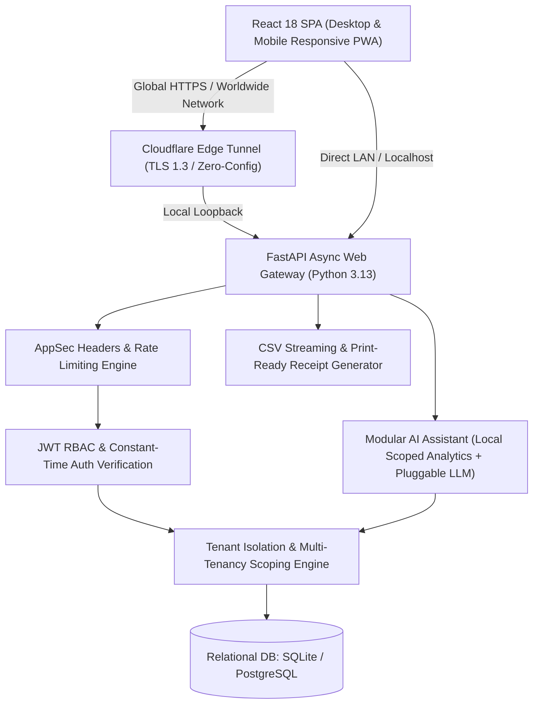
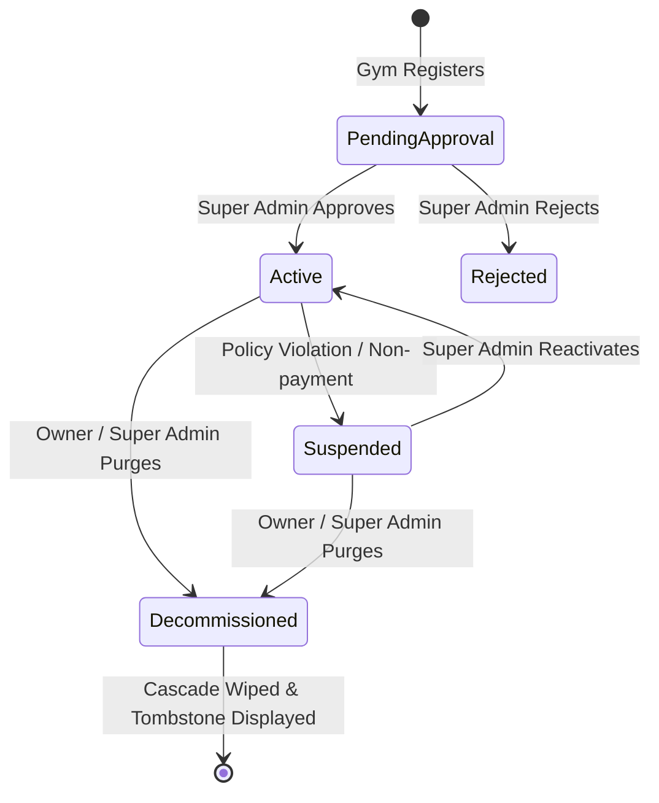

# System Architecture & Technical Design

GymPulse SaaS is built using a clean, layered architectural model that emphasizes reliability, strict data privacy across tenants, enterprise AppSec hardening, and modular extensibility.

---

## 1. High-Level Architecture

---

## 2. Multi-Tenancy & Data Isolation Model

GymPulse employs a **Shared Database, Discriminator Column (Row-Level Security)** pattern:
1. Every business entity table (`users`, `members`, `plans`, `attendance`, `payments`, `gym_inquiries`, etc.) contains a mandatory `gym_id` foreign key.
2. The FastAPI authentication dependency (`get_current_user` & `get_current_gym`) validates the JWT token, extracts `gym_id`, and verifies that the gym tenant exists, is approved by the Super Admin, and is not suspended.
3. Every repository/API query **strictly filters by `gym_id`**.
4. When a user requests an individual resource by ID (`/api/members/{id}`), the query asserts `Member.id == id AND Member.gym_id == current_gym.id`. If a user from Gym A attempts to query an ID belonging to Gym B, the query returns `404 Not Found`, eliminating any information disclosure or data leakage.

---

## 3. Platform Super Admin & Approval Lifecycle

1. **Pending Approval Gate**: When a new gym facility registers, its initial status is `pending_approval`. The owner cannot perform member operations or accept inquiries until approved.
2. **Platform Console**: The Platform Super Admin (`admin@gympulse.com`) reviews and activates facilities via `/api/platform/gyms/{gym_id}/approve`.
3. **Public Facility Website Generation**: Upon approval, the gym's dedicated HTTPS website (`/facility/{slug}`) becomes active to the public.

---

## 4. Cascade Gym Decommissioning & Website Erasure (OWASP ASVS Standard)

When a gym is decommissioned (either by its owner via the Danger Zone or by the Super Admin):
1. **High-Assurance Security Verification**:
   - Owner password re-authentication via constant-time bcrypt verification.
   - Exact facility name confirmation.
2. **Cascade Deletion Transaction**:
   - Permanently deletes all `gym_inquiries` (leads).
   - Permanently deletes all `payments` and invoices.
   - Permanently deletes all `attendance` visits.
   - Permanently deletes all `member_memberships` and member records.
   - Permanently deletes all `membership_plans` and trainer profiles.
   - Permanently deletes all authorized staff user accounts.
   - Deletes the `Gym` master record.
3. **Instant Website Tombstone**:
   - The dedicated URL `/facility/{slug}` immediately drops into a `404 Not Found` state.
   - A security tombstone informs visitors that the facility and its website have been permanently decommissioned by its owner.

---

## 5. Application Security (AppSec) Hardening

### 5.1 Constant-Time Password Verification (Timing Attack Defense)
- When a login attempt provides an unregistered email, the server executes a pre-computed dummy bcrypt verification (`dummy_verify_password`) with identical work factor.
- Ensures the server response time is indistinguishable between existent and non-existent accounts, thwarting automated email enumeration attacks.

### 5.2 Sliding-Window In-Memory Rate Limiting
- `auth_rate_limiter`: Restricts login attempts to a maximum of 30 requests per minute per IP address, preventing brute-force password guessing.
- `inquiry_rate_limiter`: Protects public lead forms against bot flooding and automated spam.

### 5.3 Enterprise Security Headers
Every HTTP response dispatched by the FastAPI gateway includes:
- `X-Content-Type-Options: nosniff` (prevents MIME type confusion attacks)
- `X-Frame-Options: SAMEORIGIN` (prevents clickjacking via malicious iframe embeds)
- `X-XSS-Protection: 1; mode=block` (activates legacy browser XSS filters)
- `Referrer-Policy: strict-origin-when-cross-origin` (prevents URL leakage to third parties)
- `Permissions-Policy: microphone=*, camera=()` (prevents unauthorized hardware access)

---

## 6. AI Assistant Architecture

The AI Copilot operates with two distinct layers:
1. **Local Scoped Analytics Engine (Default)**:
   - Evaluates intents through localized regex and keyword heuristics against the database.
   - Extracts metrics (expiring members, 14-day inactive athletes, monthly revenue, plan popularity).
   - Guarantees instant responses with **zero latency, zero third-party data transmission, and zero API costs**.
2. **Pluggable LLM Provider (Optional)**:
   - Configurable via `AI_PROVIDER=openai|gemini|anthropic`.
   - When active, the system aggregates sanitized tenant metrics for `current_user.gym_id` only and passes them as grounding context to the LLM.
   - Cross-tenant data is physically isolated and cannot be passed to the LLM prompt.

---

## 7. Frontend, PWA & Worldwide Distribution

1. **Vite SPA Compilation**: The React SPA compiles into `backend/static/` with asset hashing for instant cache invalidation.
2. **Progressive Web App (PWA)**: Includes `manifest.json` and `sw.js` for 1-tap installation on iPhone (Safari Add to Home Screen) and Android.
3. **Cloudflare Tunnel (`cloudflared`)**: Allows 1-click worldwide sharing over cellular and any Wi-Fi without manual port-forwarding or IP configuration.
4. **Standalone Portable Windows Bundle**: Pre-packaged in `GymPulse_Windows_Portable.zip` with an embedded runtime, enabling zero-install execution on Windows PCs.
