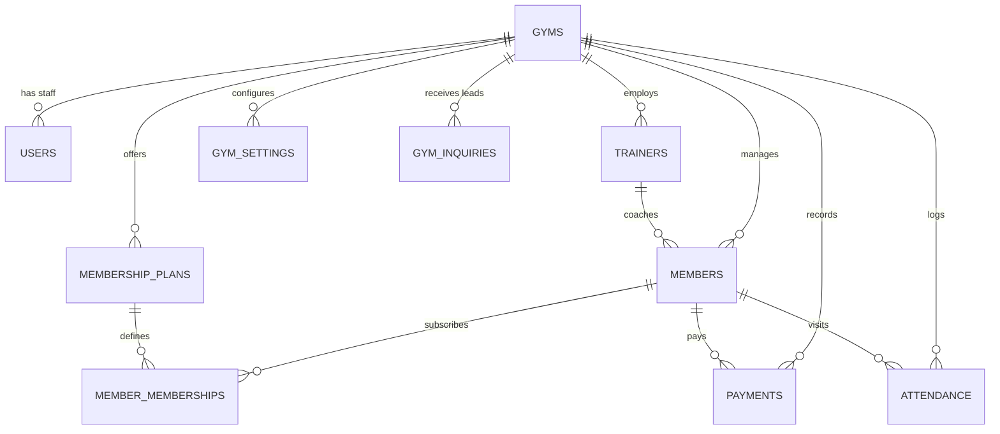

# Database Architecture & Schema Specification

GymPulse SaaS is built on a scalable relational schema designed for multi-tenant isolation, consistency, high-assurance security, and analytical query performance.

---

## 1. Entity-Relationship Diagram

---

## 2. Table Specifications

### 2.1 `gyms` (Tenant Master)
Stores gym business entity metadata, approval lifecycle, and active SaaS subscription limits.
- `id` (INT, PK, AUTO_INCREMENT)
- `name` (VARCHAR 255, NOT NULL)
- `slug` (VARCHAR 100, UNIQUE, INDEX)
- `email` (VARCHAR 255, NOT NULL)
- `phone` (VARCHAR 50, NULLABLE)
- `address` (TEXT, NULLABLE)
- `currency` (VARCHAR 10, DEFAULT 'INR')
- `logo_url` (VARCHAR 500, NULLABLE)
- `plan_tier` (VARCHAR 50, DEFAULT 'free')
- `status` (VARCHAR 50, DEFAULT 'pending_approval' - Options: 'pending_approval', 'active', 'suspended')
- `approval_notes` (TEXT, NULLABLE)
- `approved_at` (TIMESTAMP, NULLABLE)
- `subscription_status` (VARCHAR 50, DEFAULT 'active')
- `max_members` (INT, DEFAULT 25)
- `created_at` / `updated_at` (TIMESTAMP)

### 2.2 `users` (Operators & Staff)
Authorized staff, trainer, and platform super admin logins.
- `id` (INT, PK)
- `gym_id` (INT, FK -> gyms.id ON DELETE CASCADE, INDEX, NULLABLE for Super Admin)
- `full_name` (VARCHAR 255, NOT NULL)
- `email` (VARCHAR 255, NOT NULL)
- `password_hash` (VARCHAR 255, NOT NULL)
- `role` (VARCHAR 50: 'superadmin', 'owner', 'admin', 'trainer', 'staff')
- `phone` (VARCHAR 50, NULLABLE)
- `is_active` (BOOLEAN, DEFAULT TRUE)
- `reset_token` (VARCHAR 255, NULLABLE)
- `reset_token_expiry` (TIMESTAMP, NULLABLE)
- *Index*: Unique composite on `(gym_id, email)` and index on `email`

### 2.3 `gym_inquiries` (Public Website Leads)
Inquiries and free trial requests submitted via the dedicated public website (`/facility/{slug}`).
- `id` (INT, PK)
- `gym_id` (INT, FK -> gyms.id ON DELETE CASCADE, INDEX)
- `full_name` (VARCHAR 255, NOT NULL)
- `email` (VARCHAR 255, NOT NULL)
- `phone` (VARCHAR 50, NOT NULL)
- `plan_interest` (VARCHAR 100, NULLABLE)
- `message` (TEXT, NULLABLE)
- `status` (VARCHAR 50, DEFAULT 'new' - Options: 'new', 'contacted', 'converted', 'closed')
- `created_at` (TIMESTAMP)

### 2.4 `membership_plans`
Customizable membership plan packages created by the gym.
- `id` (INT, PK)
- `gym_id` (INT, FK -> gyms.id ON DELETE CASCADE, INDEX)
- `name` (VARCHAR 255, NOT NULL)
- `description` (TEXT, NULLABLE)
- `duration_days` (INT, NOT NULL)
- `price` (FLOAT, NOT NULL)
- `billing_period` (VARCHAR 50: 'monthly', 'quarterly', 'half_yearly', 'yearly', 'custom')
- `is_active` (BOOLEAN, DEFAULT TRUE)

### 2.5 `members`
Athletes and gym members registered within the tenant.
- `id` (INT, PK)
- `gym_id` (INT, FK -> gyms.id ON DELETE CASCADE, INDEX)
- `first_name` (VARCHAR 100, NOT NULL)
- `last_name` (VARCHAR 100, NOT NULL)
- `email` (VARCHAR 255, NULLABLE, INDEX)
- `phone` (VARCHAR 50, NOT NULL, INDEX)
- `date_of_birth` (DATE, NULLABLE)
- `gender` (VARCHAR 20, NULLABLE)
- `address` (TEXT, NULLABLE)
- `emergency_contact_name` (VARCHAR 150, NULLABLE)
- `emergency_contact_phone` (VARCHAR 50, NULLABLE)
- `photo_url` (VARCHAR 500, NULLABLE)
- `notes` (TEXT, NULLABLE)
- `status` (VARCHAR 50: 'active', 'expired', 'pending', 'frozen', INDEX)
- `join_date` (DATE, NOT NULL)
- `assigned_trainer_id` (INT, FK -> trainers.id ON DELETE SET NULL, NULLABLE)

### 2.6 `member_memberships`
Active and historical plan subscriptions for members with automated expiry tracking.
- `id` (INT, PK)
- `gym_id` (INT, FK -> gyms.id ON DELETE CASCADE, INDEX)
- `member_id` (INT, FK -> members.id ON DELETE CASCADE, INDEX)
- `plan_id` (INT, FK -> membership_plans.id)
- `start_date` (DATE, NOT NULL)
- `end_date` (DATE, NOT NULL, INDEX)
- `price_paid` (FLOAT, NOT NULL)
- `status` (VARCHAR 50: 'active', 'expired', 'cancelled')

### 2.7 `attendance`
Member check-in and check-out tracking records.
- `id` (INT, PK)
- `gym_id` (INT, FK -> gyms.id ON DELETE CASCADE, INDEX)
- `member_id` (INT, FK -> members.id ON DELETE CASCADE, INDEX)
- `check_in_time` (TIMESTAMP, NOT NULL, INDEX)
- `check_out_time` (TIMESTAMP, NULLABLE)
- `method` (VARCHAR 50: 'manual', 'qr', 'kiosk')
- `notes` (TEXT, NULLABLE)

### 2.8 `payments`
Transactions and customer invoices in INR (₹).
- `id` (INT, PK)
- `gym_id` (INT, FK -> gyms.id ON DELETE CASCADE, INDEX)
- `member_id` (INT, FK -> members.id ON DELETE CASCADE, INDEX)
- `membership_id` (INT, FK -> member_memberships.id ON DELETE SET NULL, NULLABLE)
- `amount` (FLOAT, NOT NULL)
- `payment_date` (DATE, NOT NULL, INDEX)
- `payment_method` (VARCHAR 50: 'cash', 'card', 'bank_transfer', 'online', 'other')
- `status` (VARCHAR 50: 'completed', 'pending', 'refunded')
- `invoice_number` (VARCHAR 100, NOT NULL, INDEX)
- `receipt_url` (VARCHAR 500, NULLABLE)

### 2.9 `trainers`
Personal trainers and coaches.
- `id` (INT, PK)
- `gym_id` (INT, FK -> gyms.id ON DELETE CASCADE, INDEX)
- `user_id` (INT, FK -> users.id ON DELETE SET NULL, NULLABLE)
- `name` (VARCHAR 255, NOT NULL)
- `email` (VARCHAR 255, NULLABLE)
- `phone` (VARCHAR 50, NOT NULL)
- `specialty` (VARCHAR 255, NULLABLE)
- `bio` (TEXT, NULLABLE)
- `hourly_rate` (FLOAT, DEFAULT 0.0)
- `is_active` (BOOLEAN, DEFAULT TRUE)

### 2.10 `gym_settings`
Facility operational configurations and customization.
- `id` (INT, PK)
- `gym_id` (INT, FK -> gyms.id ON DELETE CASCADE, UNIQUE, INDEX)
- `business_hours` (VARCHAR 255)
- `tax_percentage` (FLOAT, DEFAULT 0.0)
- `expiry_alert_days` (INT, DEFAULT 7)
- `receipt_footer_text` (TEXT)
- `primary_color` (VARCHAR 20, DEFAULT '#2563eb')
